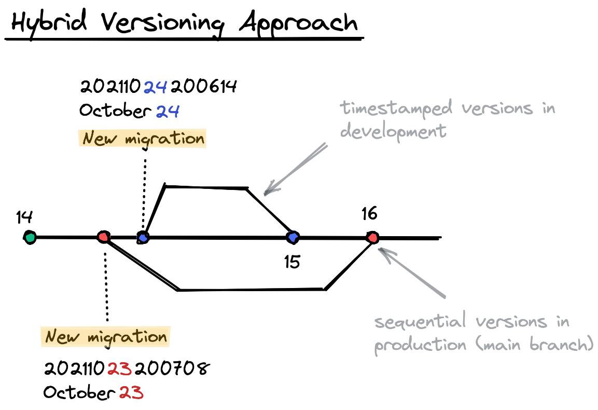

# Adding support for out-of-order migrations

Starting with `goose` [v3.3.0](https://github.com/pressly/goose/releases/tag/v3.3.0) we added the ability to apply missing (out-of-order) migrations. Thanks for all the the community feedback over the years.

Let's back it up, what are "missing" or "out-of-order" migrations?

Suppose migration 1 and 4 are applied and then 2, 3, 5 are introduced. Prior to [v3.3.0](https://github.com/pressly/goose/releases/tag/v3.3.0) `goose` would ignore migrations 2, 3 and apply only 5. Although this might seem odd, this is fairly consistent behaviour with other migration tools.

However, many users were not satisfied with this behaviour, summarized as:

- migrations 2 and 3 are "silently" ignored
- unable to apply migrations 2 and 3 if newer versions have already been applied. To paraphrase this [comment](https://github.com/pressly/goose/issues/172#issuecomment-493645187):

> *I would very much prefer just to apply Bill's migration and call it a day.*

This comment from [`@zmoazeni`](https://github.com/zmoazeni) has stuck with me over the years.

Given that `goose` maintains a full history of applied migrations in its `goose_db_version` table, we are able to resolve the database state against the migration files. And now, if missing (out-of-order) migrations are detected users can opt-in to apply them.

---

Internally within Pressly (acquired by [Alida](https://www.alida.com/)) we suggested adopting the [hybrid versioning approach](https://github.com/pressly/goose#hybrid-versioning). Briefly, in development developers create ***timestamped*** migrations, and subsequently when that PR is merged into the `main` branch its converted into a ***sequential*** migration. This is done with the `goose fix` command.

Then when a release is cut and rolled out to production only sequential migrations are applied. It was a solution to the problem that worked for our team. Yes, yes.. this does require developers to be rebasing/merging and resolving conflicts (if any) between migrations.

<figure markdown="1">
{ width=550px; }
</figure>

- A timestamped version uses a time-based format (second resolution): `20060102150405`
- A sequential version is typically a low number

There should *never* (at least in our lifetime) be a collision between timestamped and sequential versions.

Buttttt..... as we listened to community feedback, and saw the rise in the number of `goose` forks (mainly to support missing migrations), we decided the community was right. The hybrid versioning approach is not for everyone and it wasn't fair for us to impose this strict restriction.

I think this [comment](https://github.com/pressly/goose/issues/262#issue-960391249) summarized it well:

> *We should meet users in the middle (lots of great feedback from the community) and give them the flexibility to use `goose` as they see fit. The responsibility will be shifted from the tool itself, to the end user.*

To recap, this is the new behaviour of `goose`:

If you attempt to apply missing (out-of-order) migrations `goose` will raise an error (previously `goose` would ignore these migrations). However, if you do want to apply these missing migrations pass `goose` the `-allow-missing` flag, or if using as a library supply the functional option `goose.WithAllowMissing()` to Up, UpTo or UpByOne commands.

More details can be found in the [Changelog](https://github.com/pressly/goose/releases/tag/v3.3.0) and the [issue #262](https://github.com/pressly/goose/issues/262).

Hope folks find this useful. More awesome things are planned for `goose` 🚀.

ps. consider dropping [pressly/goose](https://github.com/pressly/goose) a ⭐️ if you find this package useful.