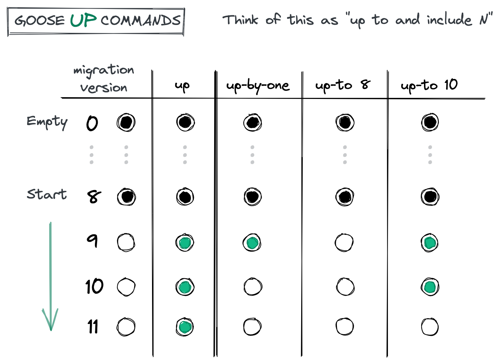
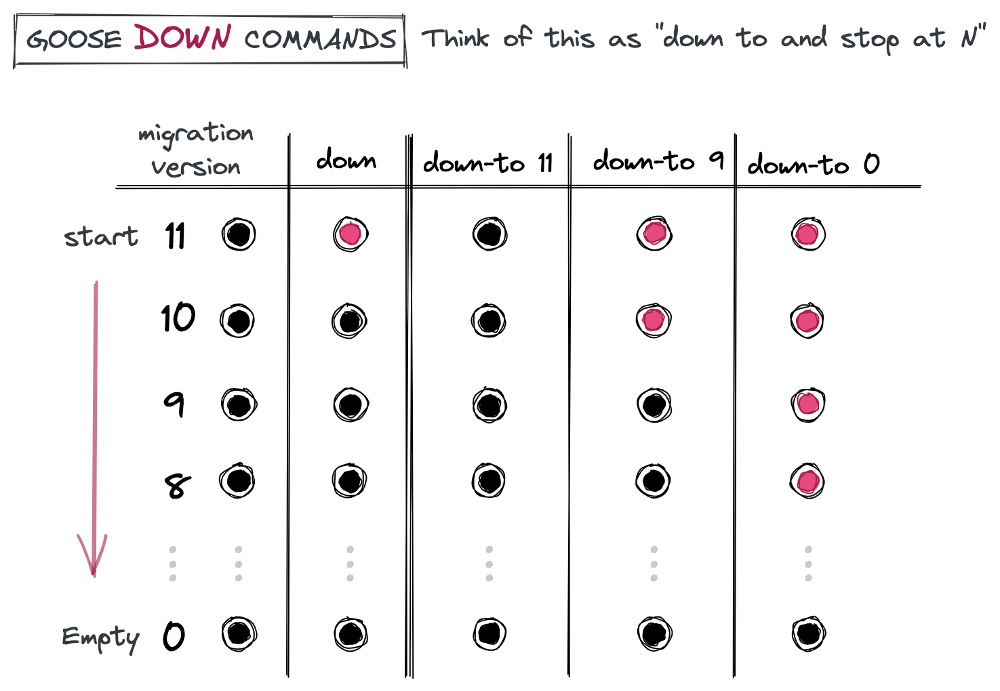

# A tour of goose up and down commands

A while ago a co-op student, who happened to be a visual leaner, asked if it were possible to explain `goose` commands visually. At the time we were still at an office, so we gathered around the whiteboard and doodled some diagrams.

This post captures some of those whiteboard sketches, which seemed to help.

## **up commands**

**`goose up`**

:   migrate all pending migrations to the most recent version


**`goose up-by-one`**

:   migrate a single pending version

**`goose up-to N`** 

:   migrate to a specific pending version, where N is a migration number

## **up examples**

Let's illustrate up commands with a concrete example.

Suppose our ./schema/migrations folder contains 11 migration files. We have previously applied 8 migrations and 3 migrations are currently pending.

Running `goose version` returns: ***goose: version 8***

Running `goose status` returns:

```
Applied At                  Migration
=======================================
Sun Dec 19 20:09:48 2021 -- 00001_a.sql
Sun Dec 19 20:09:48 2021 -- 00002_b.sql
Sun Dec 19 20:09:48 2021 -- 00003_c.sql
Sun Dec 19 20:09:48 2021 -- 00004_d.sql
Sun Dec 19 20:09:48 2021 -- 00005_e.sql
Sun Dec 19 20:09:48 2021 -- 00006_f.sql
Sun Dec 19 20:09:48 2021 -- 00007_g.sql
Sun Dec 19 20:09:48 2021 -- 00008_h.sql
Pending                  -- 00009_i.sql
Pending                  -- 00010_j.sql
Pending                  -- 00011_k.sql
```

- Running `goose up` applies all 3 pending migrations: 9, 10 and 11
- Running `goose up-by-one`  applies only migration 9
- Running `goose up-to 8` does nothing, since 8 has already been applied
- Running `goose up-to 10` applies migrations 9 and 10

<figure markdown="1">
{ width=550px; }
</figure>

## **down commands**

**`goose down`**

:   migrate the latest version down


**`goose down-to N`** 

:   migrate down to a specific version, where N is a migration number

## **down examples**

Let's illustrate down commands, continuing with the above example. We have previously applied all 11 migrations from the ./schema/migrations folder.

Running `goose version` returns: ***goose: version 11***

Running `goose status` returns:

```
Applied At                  Migration
=======================================
Sun Dec 19 21:31:11 2021 -- 00001_a.sql
Sun Dec 19 21:31:11 2021 -- 00002_b.sql
Sun Dec 19 21:31:11 2021 -- 00003_c.sql
Sun Dec 19 21:31:11 2021 -- 00004_d.sql
Sun Dec 19 21:31:11 2021 -- 00005_e.sql
Sun Dec 19 21:31:11 2021 -- 00006_f.sql
Sun Dec 19 21:31:11 2021 -- 00007_g.sql
Sun Dec 19 21:31:11 2021 -- 00008_h.sql
Sun Dec 19 21:31:11 2021 -- 00009_i.sql
Sun Dec 19 21:31:11 2021 -- 00010_j.sql
Sun Dec 19 21:31:11 2021 -- 00011_k.sql
```

- Running `goose down` applies the down migration for 11
- Running `goose down-to 11`  does nothing
- Running `goose down-to 9` applies the down migrations for 11 and 10
- Running `goose down-to 0` applies all down migrations

<figure markdown="1">
{ width=550px; }
</figure>

!!! note ""

    **Bonus**
    
    `goose down-to 0` is the same as `goose reset`. Applying **all** down migrations.

    `goose redo` is the same as `goose down` followed by `goose up-by-one`. Reapplying the latest migration.