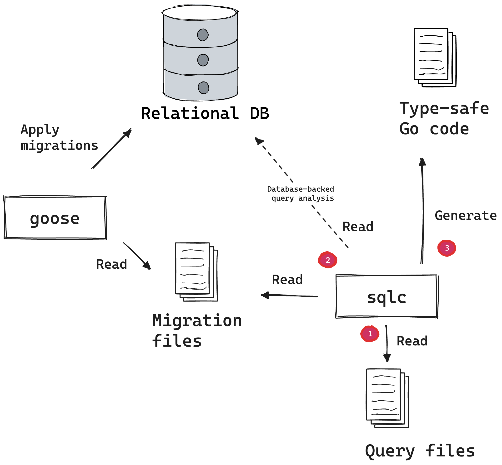

# Using `sqlc` and `goose`

In this post, we give you a brief introduction to `sqlc` and show you how to use it with `goose`.

<!-- more -->

For those unfamiliar, [sqlc](https://sqlc.dev/) is a SQL compiler that generates Go code from your
SQL queries, and [goose](https://github.com/pressly/goose) is a database migration tool for managing
your database schema's evolution.

Together, these tools can be quite powerful. They allow you to create SQL queries in a type-safe
manner and consistently manage your database schema's evolution in a repeatable way.

## Overview

A common question is, "What is the relationship between `sqlc` and `goose`?"

To answer this, let's take a step back and _briefly_ outline what `sqlc` does:

1. Parses SQL statements
2. Analyzes the SQL statements
3. Generates type-safe Go code for applications to use those statements

In the second step, `sqlc` requires the database schema to generate the type-safe Go code. This can
be accomplished by either pointing `sqlc` at a database or supplying the schema files.

Importantly, the schema files are the same ones you create to establish the database schema and
apply with `goose`.

<figure markdown="1">
{ width=400px; }
</figure>

For a comprehensive overview of how `sqlc` works and how to use an ephemeral database for more
robust type-analysis, refer to the
[leverage Database-backed query analysis](https://sqlc.dev/posts/2023/10/24/sqlc-v1-23-0-database-backed-analyzer/)
blog post.

Being able to validate and analyze SQL statements against a database schema greatly improves the
maintainability and correctness of your application. **It enables you to identify errors, like
typos, missing columns, or incorrect types, during development and compile time rather than at
runtime**.

## Example

If you just want to see the code, check out
[mfridman/goose-demo](https://github.com/mfridman/goose-demo). In that repository, you will find a
simple Go application that uses `sqlc` and `goose` to interact with a SQLite database.

You can clone the repository, and run `go run ./cmd/custom-goose`. It should print out a list of
users randomly added with
[moby/moby namesgenerator](https://pkg.go.dev/github.com/moby/moby@v24.0.6+incompatible/pkg/namesgenerator).

### Pre-requisites

Before we start, make sure you have the following installed:

- [Go](https://golang.org/doc/install), version 1.20 or later
- [sqlc](https://docs.sqlc.dev/en/latest/overview/install.html)
- [goose](https://pressly.github.io/goose/installation/)

### Step 1 - Write migrations

First, we need to write the database migrations themselves. We'll dump them in a
`./data/sql/migrations/` directory, but you can put them anywhere you like.

Note, the demo repository uses a few advanced features of `goose` that are not strictly necessary,
such as embedding SQL files in a binary (`//go:embed *.sql`), using Go migrations, and building up a
custom [`goose.Provider`](https://pressly.github.io/goose/blog/2023/goose-provider/).

Alright, moving on. Here's an example of a migration file:

```sql title="data/sql/migrations/00001_users_table.sql"
-- +goose Up
CREATE TABLE users (
    id INTEGER PRIMARY KEY AUTOINCREMENT,
    username text NOT NULL
);

-- +goose Down
DROP TABLE users;
```

### Step 2 - Prepare a sqlc.yaml file

Next, we need to prepare a `sqlc.yaml` configuration file. It's beyond the scope of this post to
explain all the options (see the
[sqlc documentation](https://docs.sqlc.dev/en/latest/reference/config.html#version-2)), but here's a
minimal example:

```yaml title="sqlc.yaml"
version: "2"
sql:
  - schema: "data/sql/migrations" #(1)!
    queries: "data/sql/queries" #(2)!
    engine: "sqlite"
    gen:
      go:
        out: "gen/dbstore"
```

1.  The `schema` field tells `sqlc` where to look for the database schema. In this case, we're
    pointing it at the same directory where we put our migrations.
2.  The `queries` field tells `sqlc` where to look for the SQL query files. In this case, we're
    pointing it at a `./data/sql/queries/` directory.

### Step 3 - Write SQL queries

Now we can write some SQL queries that will get generated into Go code by `sqlc`. We'll dump them in
a `./data/sql/queries/` directory. Here's an example of a query file:

```
data/sql/queries/
└── users.sql
```

```sql title="data/sql/queries/users.sql"
-- name: ListUsers :many
SELECT * FROM users ORDER BY username;
```

Now, we're jumping ahead a bit, but let's imagine we mispelled `users` table as `usres` in the
query.`sqlc` would catch this error much earlier than if we were to run the application and hit the
query at runtime.

```bash
$ sqlc generate
# package
data/sql/queries/users.sql:1:1: relation "usres" does not exist
```

### Step 4 - Run `sqlc generate`

Now we can run `sqlc generate` to generate the Go code. This will create a `gen/dbstore` directory
with the generated Go code.

```
$ sqlc generate
```

And that's it! We now have a `gen/dbstore` directory with the generated Go code. Here's a snippet of
what the generated code looks like:

```go title="gen/dbstore/users.sql.go"
const listUsers = `-- name: ListUsers :many
SELECT id, username FROM users ORDER BY username
`

func (q *Queries) ListUsers(ctx context.Context) ([]User, error) {
	rows, err := q.db.QueryContext(ctx, listUsers)
	if err != nil {
		return nil, err
	}
	defer rows.Close()
	var items []User
	for rows.Next() {
		var i User
		if err := rows.Scan(&i.ID, &i.Username); err != nil {
			return nil, err
		}
		items = append(items, i)
	}
	if err := rows.Close(); err != nil {
		return nil, err
	}
	if err := rows.Err(); err != nil {
		return nil, err
	}
	return items, nil
}
```

Bonus, `sqlc` takes care of executing, scanning and closing the rows for you. It also takes care of
error handling and returning the results.

ps. How many times have you forgotten to close the rows?

## Wrapping up

There's a lot more to `sqlc` and `goose` than what we've covered here, but hopefully this gives you
a good starting point for using these tools together.
